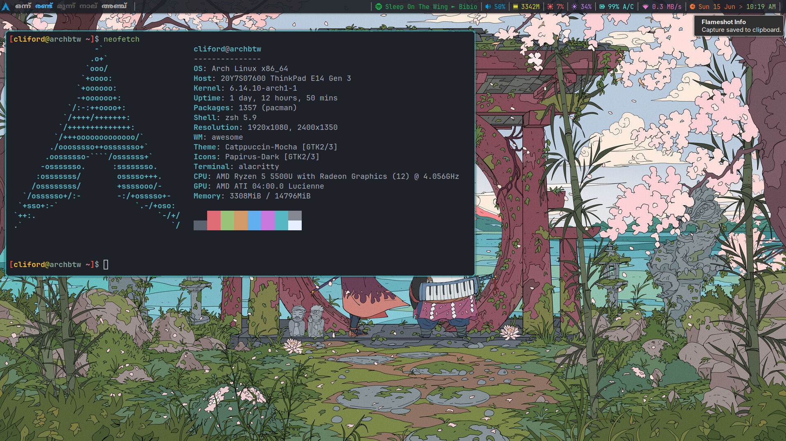

# dotfiles




To migrate to these dotfiles,

- Create the directory $HOME/.cfg and add a gitignore file (to avoid recursion issues)

```bash
echo .cfg >> .gitignore
```

- Clone this repo to the .cfg directory

```bash
git clone --bare <git-repo-url> $HOME/.cfg
```

- Define the following alias for the current session.

```bash
alias config='/usr/bin/git --git-dir=$HOME/.cfg/ --work-tree=$HOME'
```

- Checkout the actual content from the bare repository to $HOME

```bash
config checkout
```

- Set the flag showUntrackedFiles to no on this specific (local) repository

```bash
config config --local status.showUntrackedFiles no
```

Refer [here](https://www.atlassian.com/git/tutorials/dotfiles) for more info.
